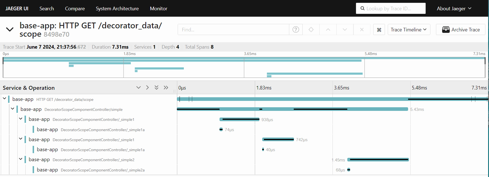

# @mwcp/otel

Open Telemetry Component for Midway.js

[]()
[](https://www.npmjs.com/package/midway-components)
[](https://opensource.org/licenses/MIT)
[]()
[](https://github.com/waitingsong/midway-components/actions)
[](https://codecov.io/gh/waitingsong/midway-components)
[](https://conventionalcommits.org)
[](https://lernajs.io/)


## Note

ESM build only, requires `@midwayjs >= 3.16` and set `"type": "module"` in `packages.json`

## Support Schemes

- HTTP
- [gRPC (Unary)]

## Install

```sh
npm i @mwcp/otel
```

## Configuration

Update project `src/configuration.ts`
```ts
import { Configuration } from '@midwayjs/decorator'
import * as koa from '@midwayjs/koa'
import * as otel from '@mwcp/otel'

@Configuration({
  imports: [
    koa,
    otel,
  ],
  importConfigs: [join(__dirname, 'config')],
})
export class ContainerConfiguration implements ILifeCycle {
}
```

## Usage

- [Exporter][Exporter]
- [Exporter Configuration][Exporter Configuration]

To try out the [OTLPTraceExporter][Exporter Configuration] quickly, you can run [Jaeger] in a docker container:
```sh
docker run -d --name jaeger \
  -e COLLECTOR_OTLP_ENABLED=true \
  -p 4317:4317 \
  -p 4318:4318 \
  -p 5778:5778 \
  -p 6831:6831/udp \
  -p 6832:6832/udp \
  -p 16686:16686 \
  jaegertracing/all-in-one:latest
```

Start project:
```sh
export OTEL_EXPORTER_OTLP_ENDPOINT=http://localhost:4317
npm start
```

[Jaeger] Web UI address:
> http://localhost:16686/


## `Trace` Decorator

```ts
import { Trace } from '@mwcp/otel'

@Controller('/')
export class FooController {

  @Inject() readonly svc: FooService

  /* span name will be `{class name}/{method name}` => "FooController/hello" */
  @Trace()
  async hello(): Promise<string> {
    return 'hello'
  }

  /* span name will be "hello" */
  @Trace('hello')
  async world(): Promise<string> {
    return 'world'
  }

  @Trace({
    spanName: 'hello'
  })
  async world2(): Promise<string> {
    return 'world'
  }
}
```

Pass `scope` to avoid the confusion of call chain relationship when async methods are called concurrently

```ts
import { Trace } from '@mwcp/otel'

@Controller('/')
export class FooController {
  @Trace()
  async hello(): Promise<string> {
    await Promise.all([
      this._simple1(),
      this._simple2(),
    ])
    return 'OK'
  }

  @Trace({ scope: 'hello1' })
  async _hello1(): Promise<string> {
    return 'world'
  }

  @Trace({ scope: 'hello2' })
  async _hello2(): Promise<string> {
    return 'world'
  }

  @Trace({ scope: 'hello1' })
  async _hello1a(): Promise<string> {
    return 'world'
  }

  @Trace({ scope: 'hello2' })
  async _hello2a(): Promise<string> {
    return 'world'
  }
}
```



Use `this` inner `before()` `after()` point to the decorated instance

```ts
export class FooService {
  foo = 1

  @Trace<Foo['home']>({
    before([options], decoratorContext) {
      assert(this instanceof FooService) // <--- this point to FooService 
      assert(this === decoratorContext.instance)
      assert(this.foo === 1)

      return void 0
    },
    after([options], res, decoratorContext) {
      assert(this instanceof FooService)
      assert(this === decoratorContext.instance)
      assert(this.foo === 1)

      return void 0
    },
  })
  async home(this: FooService, options: InputOptions): Promise<string> { // <--- pass this type explicitly
    const ret = await options.input
    return ret
  }
}
```


## `TraceLog` Decorator

Add trace attribute to the span through decorator before()/after() method return object,
no new span starting
- add trace tag/log to current active span
- add trace tag/log to root span

Note return value of decorated method `before()` and `after()` should be type:
```ts
interface DecoratorTraceData {
  attrs?: Attributes
  events?: Attributes
  rootAttrs?: Attributes
  rootEvents?: Attributes
}
```


```ts
import { TraceLog, DecoratorTraceData } from '@mwcp/otel'

@Controller('/')
export class FooController {

  @Trace()
  async hello(): Promise<string> {
    return 'hello'
  }

  @TraceLog({
    before: async ([input], { instanceName, methodName }) => {
      const attrs: Attributes = {
        args0: input,
      }
      const events: Attributes = {
        ...attrs,
        instanceName,
        methodName,
      }
      const rootAttrs: Attributes = { rootAttrs: 'rootAttrs' }
      const rootEvents: Attributes = { ...rootAttrs }

      return { attrs, events, rootAttrs, rootEvents } as DecoratorTraceData
    },
    after: ([input], res, { instanceName, methodName }) => {
      const attrs: Attributes = {
        args0: input,
        res,
      }
      const events: Attributes = {
        ...attrs,
        instanceName,
        methodName,
      }
      return { events }
    },
  })
  async world(): Promise<string> {
    return 'world'
  }
}
```


## `TraceInit` Decorator

```ts
// src/configuration.ts
import { TraceInit } from '@mwcp/otel'

export class AutoConfiguration implements ILifeCycle {
  @TraceInit({ namespace: 'Foo' })
  async onReady(container: IMidwayContainer): Promise<void> {
    // some code
  }
}
```


## Decorator Generics
### Auto parameter type of keyGenerator from generics

```ts
@Controller('/')
export class FooController {

  @Inject() readonly svc: FooService

  hello(): string {
    // spanName should be 'foo-124-abc'
    const msg = this.svc.concat(123, 'abc')
    return msg
  }
}

@Provide()
export class FooService {
  @Trace<FooService['concat']>({
    spanName: ([v1, v2]) => `foo-${v1 + 1}-${v2}`,
  })
  concat(v1: number, v2: string): string {
    return `${v1.toString()}-${v2}`
  }

  @Trace<FooService['concat2']>({
    spanName: (args) => `foo-${args[0] + 1}-${args[1]}`,
  })
  concat2(v1: number, v2: string): string {
    return `${v1.toString()}-${v2}`
  }
}
```


## License
[MIT](LICENSE)


### Languages
- [English](./README.md)
- [中文](./README.zh-CN.md)

<br>

[Exporter]: https://opentelemetry.io/docs/instrumentation/js/exporters/
[Exporter Configuration]: https://opentelemetry.io/docs/reference/specification/protocol/exporter/#configuration-options
[Jaeger]: https://www.jaegertracing.io/

[gRPC (Unary)]: https://github.com/midwayjs/midway/tree/main/packages/grpc

